(Developer: Slava Kondriianenko)

Discover Ukraine is a website for tourists who want to go on a trip to Ukraine. The website presents the most visited places of Ukraine, as well as a shop where you can choose some souvenirs from the country.

[Live website](https://viacheslav1510.github.io/Portfolio_Project_1-Explore_Ukraine/)

## Table of Content
- [Table of Content](#table-of-content)
- [Project Goals](#project-goals)
  - [User Goals](#user-goals)
  - [Site Owner Goals](#site-owner-goals)
- [User Experience](#user-experience)
  - [Target Audience](#target-audience)
  - [User Requirements and Expectations](#user-requirements-and-expectations)
  - [User Stories](#user-stories)
    - [First-time User](#first-time-user)
    - [Returning User](#returning-user)
    - [Site Owner](#site-owner)
- [Design](#design)
  - [Design Choices](#design-choices)
  - [Colour](#colour)
  - [Font](#font)
  - [Structure](#structure)
  - [Wireframes](#wireframes)
- [Technologies Used](#technologies-used)
  - [Languages](#languages)
  - [Frameworks \& Tools](#frameworks--tools)
- [Features](#features)
  - [Header](#header)
  - [Tours section](#tours-section)
  - [Contacts section and footer section](#contacts-section-and-footer-section)
  - [Shop page main section](#shop-page-main-section)
  - [Shop page google map section](#shop-page-google-map-section)
  - [Page 404](#page-404)
- [Validation](#validation)
  - [HTML Validation](#html-validation)
  - [CSS Validation](#css-validation)
    - [Accessibility](#accessibility)
  - [Performance](#performance)
    - [Desktop](#desktop)
    - [Mobile](#mobile)
  - [Browser compatibility](#browser-compatibility)
  - [Testing user stories](#testing-user-stories)
- [Bugs](#bugs)
- [Credits](#credits)
  - [Code](#code)
  - [Media](#media)
- [Acknowledgements](#acknowledgements)
    
## Project Goals

### User Goals
- Find directions for travel
- Find what to do in country
- Explore the country's culture
- Be inspired by a new journey
- Buy a souvenir for yourself or for your relatives
### Site Owner Goals
- Find customers for business
- Show customer new country to visit
- Inspire a person on a new journey
- Provide a clear information about tours through Ukraine
- Provide a way to contact the business
- Provide access to the gift shop

## User Experience

### Target Audience
- People deciding where to go on a trip
- People who love travel
- People looking for gifts for themselves and their relatives
### User Requirements and Expectations
- Great content that will make the customer think about the trip
- Intuitive navigation, which will help you navigate the site easily
- Good presentation and consistent design on all screens
- An easy way to contact business
- The shop's product description is available
  
### User Stories

#### First-time User 
1. As a first time user, I want to be inspired to travel
2. As a first time user, I want to know the best places in the country
3. I want to find a place to stay and a good place to eat
4. I want to apply for a tour calculation
5. I want to find the best souvenirs to remember the trip
6. As a first time user, I want easy to contact the company and get a response
  
#### Returning User
7. As a a returning user, I want to find new ways to travel
8. I want to see the possibility of recreation in the mountains or at the sea, as well as the sights of the cities
9. As a returning user, I want to leave some comment, suggestion or message to the staff
10. As a returning user, I want to find the company on social media
11. I want to easily find a souvenir shop on the map
#### Site Owner
12. As the site owner, I want users to easy find what this website about
13. As the site owner, I want users to to get to know the most common places in Ukraine.
14. As the site owner, I want users to be able to contact us.
15. As the site owner, I want to give users an opportunity to choose souvenirs from the store.
16. Tell my website viewers information if the requested page is unavailable or, in some cases, doesn't exist.

## Design

### Design Choices
The web page has been designed keeping in mind the first expression that the customer may have during his first perception. The first look captures the mountain landscape at sunrise with Burnt Maroon color for logo and navigation. Scrolling down the page, the user gets to the significant places section on a soft green (light shade of green) background, which makes customer to stay longer on the website and calmly enjoy the view of the place due to calm shades of the page. 
A minimalist style was chosen for the shop page in order to keep the customer's eye on the products rather than overall view, where photos of souvenirs with a Burnt Maroon title are placed on a white background.
### Colour
For the colour sheme maroon tones were chosen to match the most important information on the page and also the media elements in the footer. The main section with significant places highlighted with a soft green color. Contacts were highlighted with calmly shade of cyan. To narrow down the colours I used Adobe Color. 
 

### Font
Montserrat was used for the main page and shop page. Bold font indicates headings, while normal text is used for paragraphs. 
### Structure
The page is structured in a well know, recognizable, user friendly, and easy to learn way. Upon arriving to the website the user sees a familiar type of navigation bar with the business logo on the left side and the navigation links to the right.
Website consists of two separate pages:
- Home page with four sections:
  - Main heading section with background image and navigation bar .
  - Tours section with four significant places.
  - Contacts section with information about business and contact form.
  - Section with links for social media.
- Shop page:
  - Navigation bar on the top of the page.
  - Section with souvenirs examples and their description.
  - Google map section to find the shop on the map
### Wireframes

Home

Shop

Error page

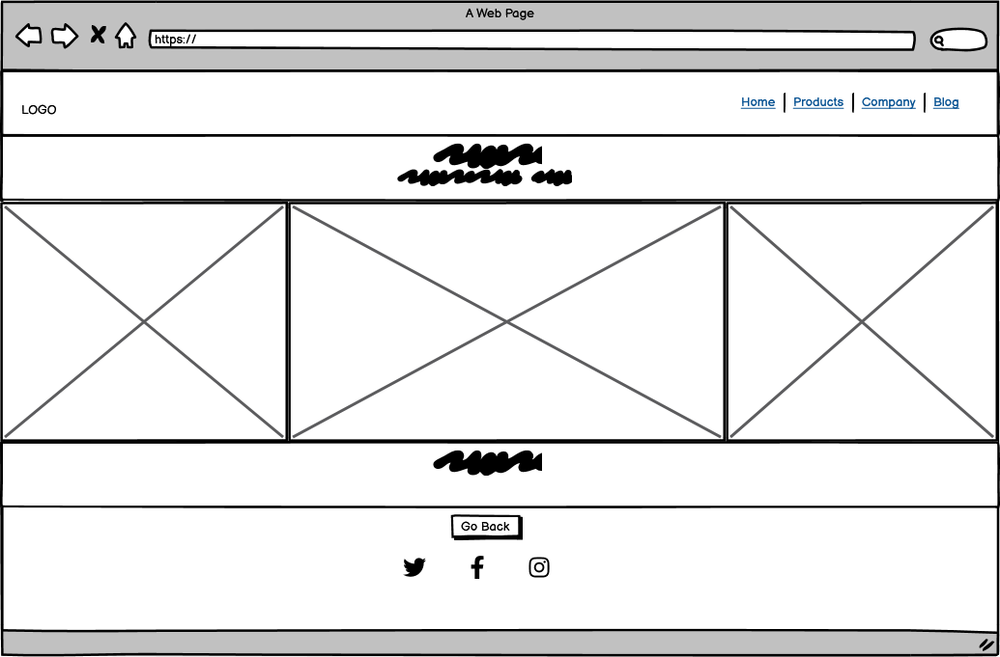

## Technologies Used

### Languages
- HTML
- CSS
### Frameworks & Tools
- [Bootstrap v5.2 navbar documentation](https://getbootstrap.com/docs/5.2/components/navbar/#how-it-works)
- Git
- GitHub
- Gitpod
- Visual Studio
- Color Hunt
- Adobe Color
- Balsamiq
- Google Fonts
- Font Awesome
- Favicon

## Features
### Header
- The header contains background image, navbar with logo and main text.
- Navbar is sticky on scrolling and let the user navigate through sections and pages.
- The header is responsive on all screens.
- User stories covered: 1, 12.

### Tours section
- The tours section shows several significant places with links, which helps to find more detailed information about tour.
- User stories covered: 3, 7, 8, 13.
  

### Contacts section and footer section
- Contacts section show information about company and gives an opportunity to contact the company representative with a question or proposal.
- Footer contains icon links to social media.
- User stories covered: 4, 6, 9, 10, 13.
  

### Shop page main section
- Shop main section contains ideas for souvenirs from Ukraine and their description.
- User stories covered: 5, 15.

### Shop page google map section
- The last section shows google map, which helps user to find offline shop.
- User stories covered: 11.

### Page 404
- Tells website viewers the requested page is unavailable or, in some cases, doesn't exist and gives user opportunity to go back to main page.
- User stories covered: 16.
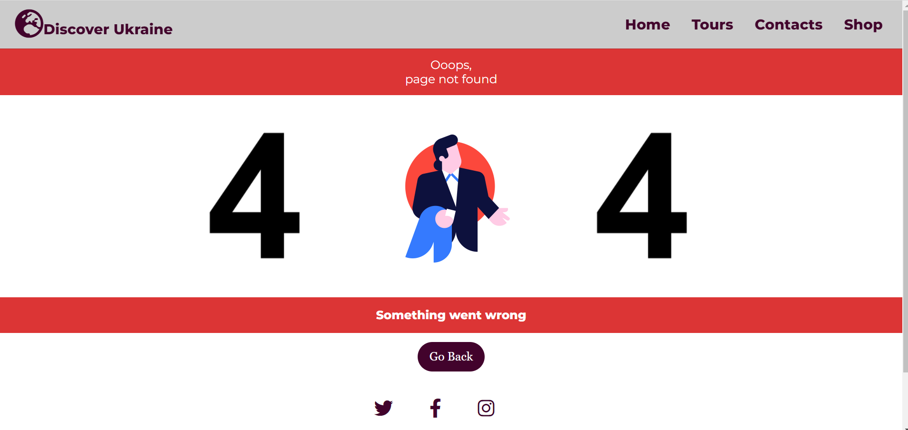

## Validation

### HTML Validation
Tested HTML code with [W3C Validator](https://validator.w3.org/).

Home

Shop

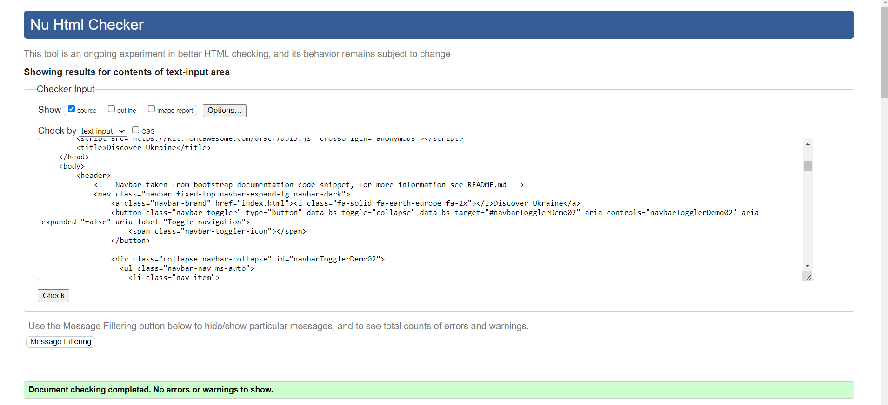

### CSS Validation
Tested CSS code with [W3C Jigsaw CSS Validation Service](https://jigsaw.w3.org/css-validator/).
When validating the page as a whole, the validator shows some errors linked to Bootstrap v5.0. When validating just my own custom CSS it passes with no errors found and some warnings associated to using root variables.

Whole page

Custom CSS

  

#### Accessibility
The WAVE WebAIM web accessibility evaluation tool was used to ensure the website met high accessibility standards.

Home

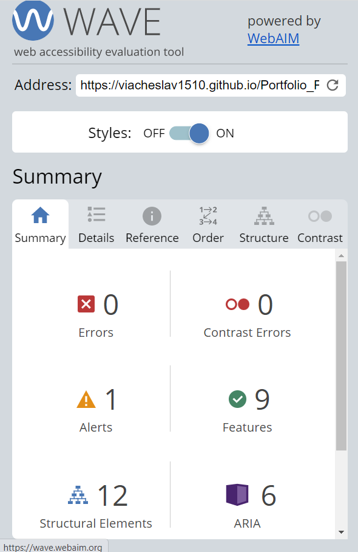

Shop

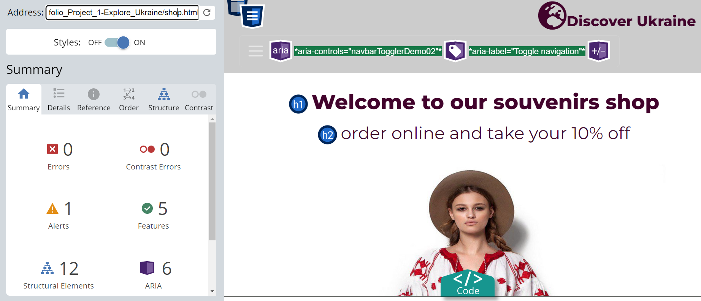

  

### Performance
Google Lighthouse in Google Chrome Developer Tools was used to test the performance of the website.
#### Desktop

Home

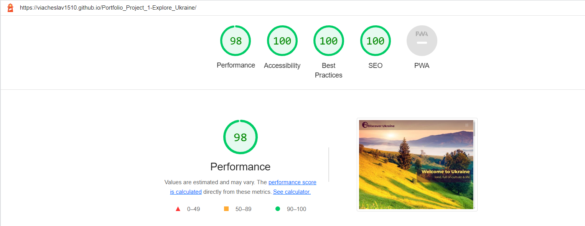

Shop

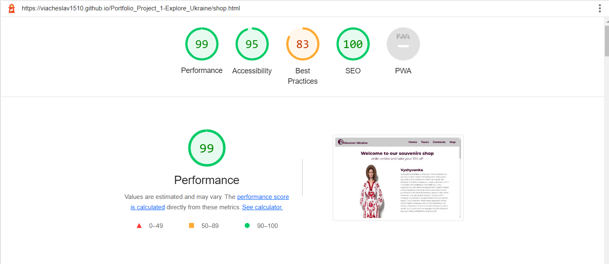

 

#### Mobile

Home

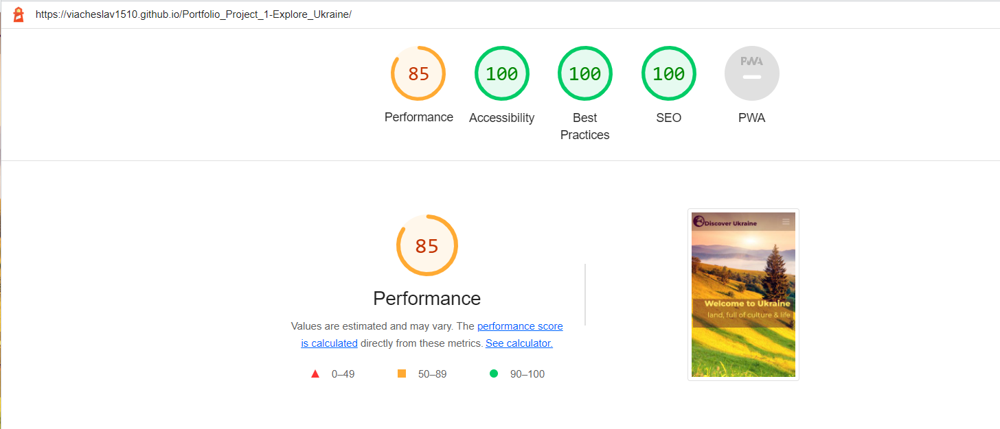

Shop

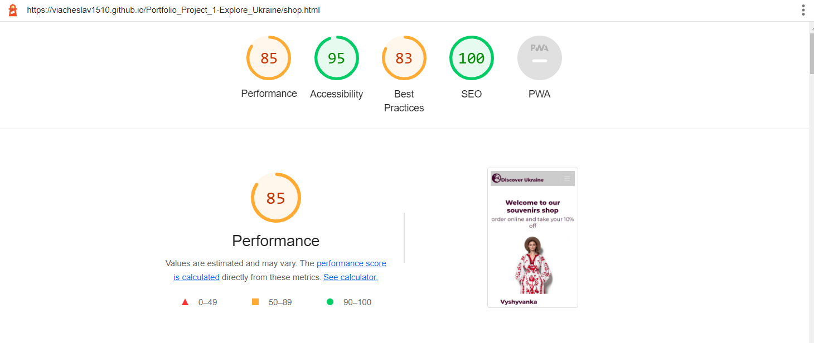

 

### Browser compatibility
The website was tested on the following browsers:
- Google Chrome
- Mozilla Firefox
- Microsoft Egde
- Safari

### Testing user stories
1. As a first time user, I want to be inspired to travel

| **Feature** | **Action** | **Expected Result** | **Actual Result** |
|-------------|------------|---------------------|-------------------|
| Header | Open Webpage | The first feeling from the seen picturesque nature inspires for travel| Works as expected |

Screenshots

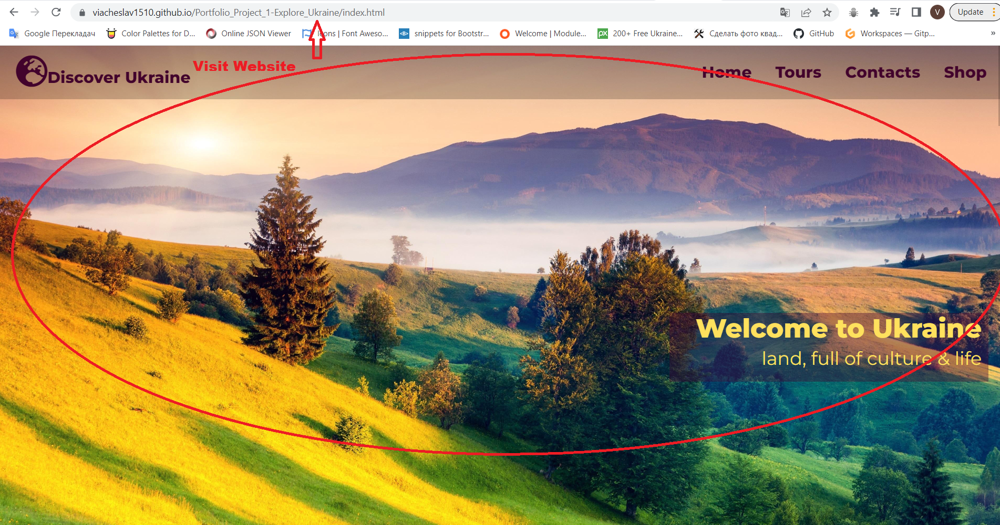

2. As a first time user, I want to know the best places in the country
   
| **Feature** | **Action** | **Expected Result** | **Actual Result** |
|-------------|------------|---------------------|-------------------|
| Tours section | Click "Tours" in navbar | See several significant places with links, which helps to find more detailed information about tour.| Works as expected |

Screenshots

3. I want to find a place to stay and a good place to eat

| **Feature** | **Action** | **Expected Result** | **Actual Result** |
|-------------|------------|---------------------|-------------------|
| Tours section | Click "Tours" in navbar and tap link "Find more" | See website, which helps to find more detailed information about city and it's significant places.| Works as expected |

Screenshots

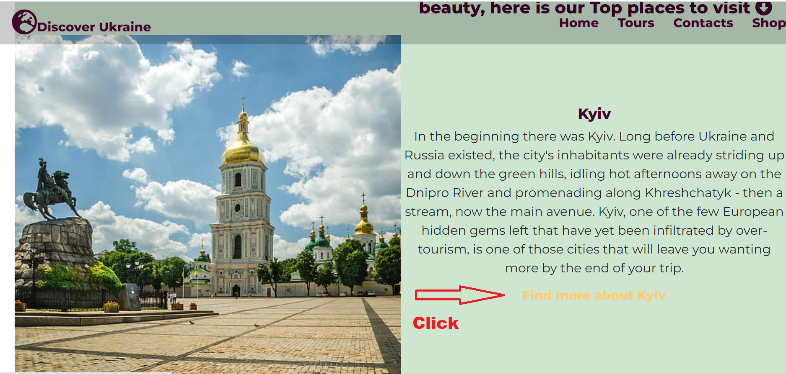
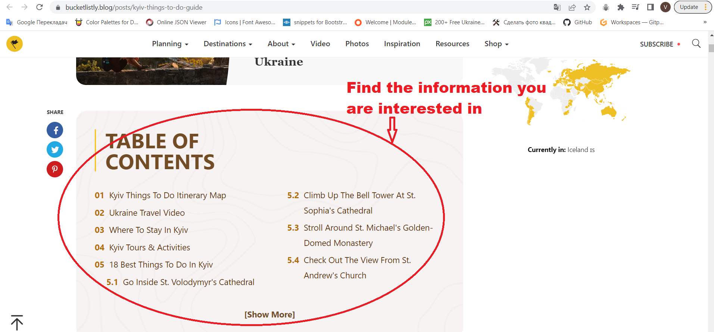

4. .6 I want to apply for a tour calculation or as a first time user, I want easy to contact the company and get a response.

| **Feature** | **Action** | **Expected Result** | **Actual Result** |
|-------------|------------|---------------------|-------------------|
| Contacts section | Click "Contacts" in navbar and fill out the form | See contact form, which helps to get in touch with company| Works as expected |

Screenshots

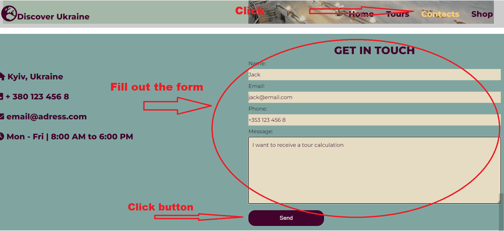

5. I want to find the best souvenirs to remember the trip

| **Feature** | **Action** | **Expected Result** | **Actual Result** |
|-------------|------------|---------------------|-------------------|
|Home page | Click "Shop" in navbar | See shop page| Works as expected |
|Shop page | Scroll down | See ideas for souvenirs| Works as expected |

Screenshots

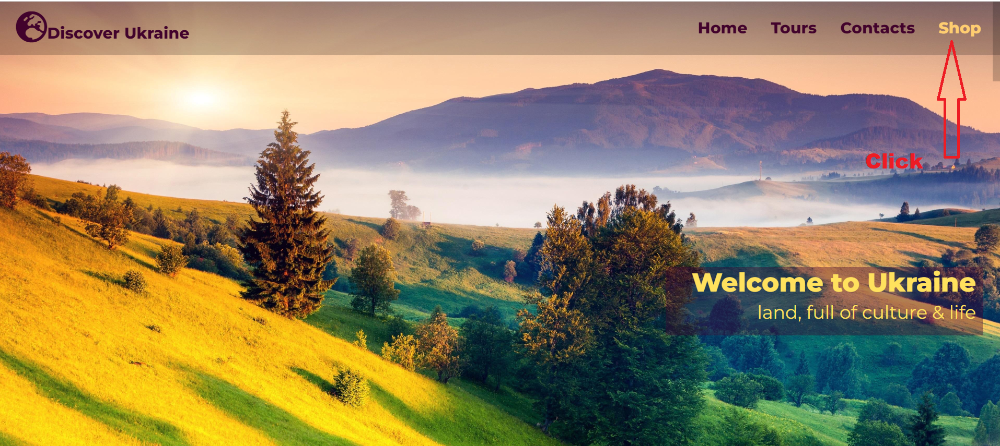
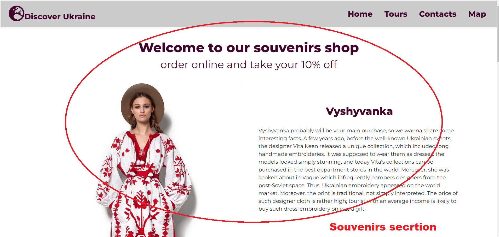

7. .8 As a a returning user, I want to find new ways to travel and I want to see the possibility of recreation in the mountains or at the sea, as well as the sights of the cities.

| **Feature** | **Action** | **Expected Result** | **Actual Result** |
|-------------|------------|---------------------|-------------------|
|Home page | Click "Tours" in navbar | See tours section with ideas for travel| Works as expected |
|Home page | Scroll down through tours section | See several significant places| Works as expected |

Screenshots

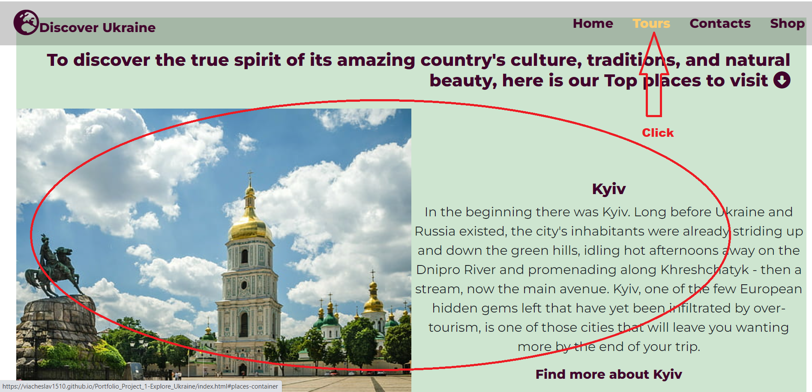
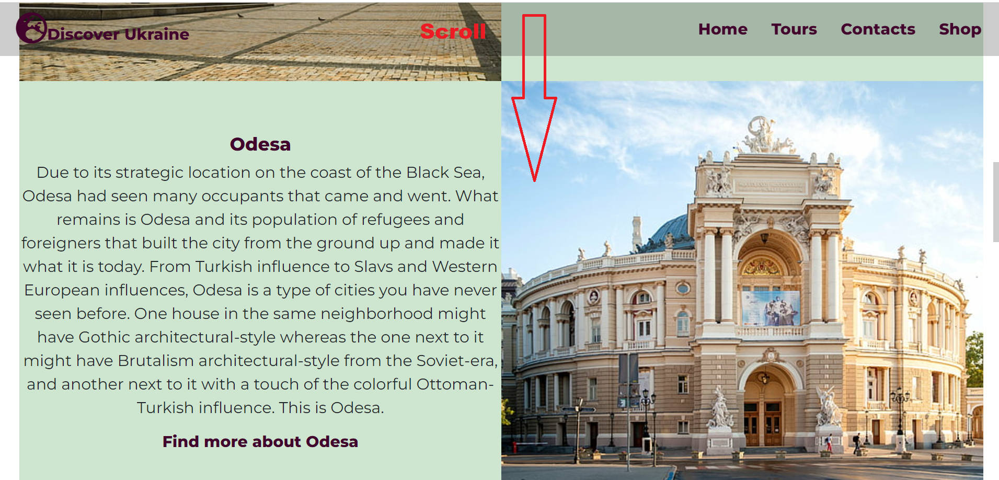

9. As a returning user, I want to leave some comment, suggestion or message to the staff.

| **Feature** | **Action** | **Expected Result** | **Actual Result** |
|-------------|------------|---------------------|-------------------|
| Contacts section | Click "Contacts" in navbar | See contact form and information about company | Works as expected |

Screenshots

10.  As a returning user, I want to find the company on social media.

| **Feature** | **Action** | **Expected Result** | **Actual Result** |
|-------------|------------|---------------------|-------------------|
|Home page | Click "Contacts" in navbar | See contacts section with social links in a bottom| Works as expected |

Screenshots

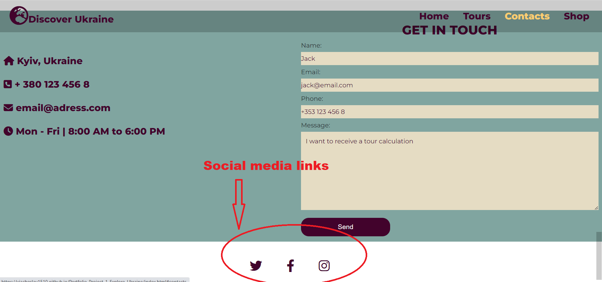

11. I want to easily find a souvenir shop on the map

| **Feature** | **Action** | **Expected Result** | **Actual Result** |
|-------------|------------|---------------------|-------------------|
|Home page | Click "Shop" in navbar | See shop page| Works as expected |
|Shop page | Click "Map" in navbar | See google map to find shop| Works as expected |

Screenshots

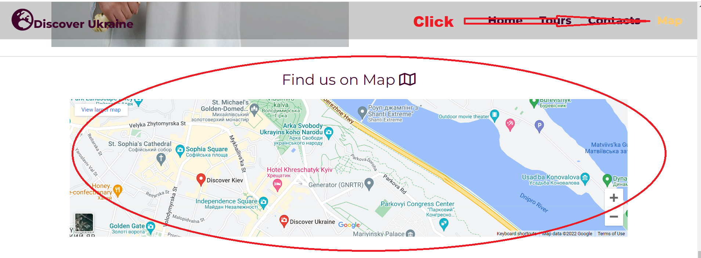

12. As the site owner, I want users to easy find what this website about

| **Feature** | **Action** | **Expected Result** | **Actual Result** |
|-------------|------------|---------------------|-------------------|
|Header | Open Webpage | The main text shows what this website about| Works as expected 

Screenshots

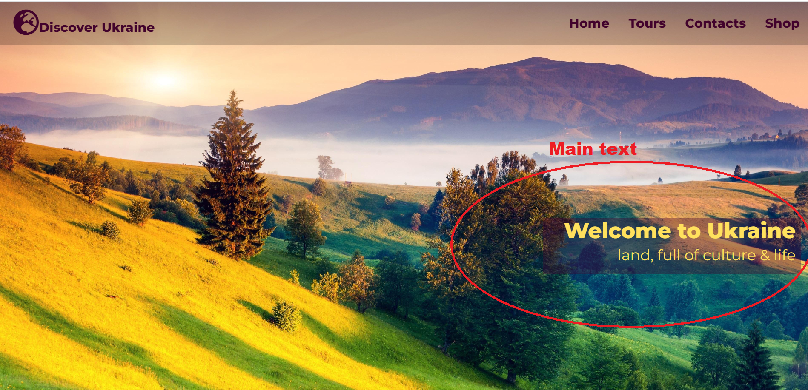

13.  As the site owner, I want users to to get to know the most common places in Ukraine.

| **Feature** | **Action** | **Expected Result** | **Actual Result** |
|-------------|------------|---------------------|-------------------|
| Tours section | Click "Tours" in navbar | See several significant places| Works as expected |

Screenshots

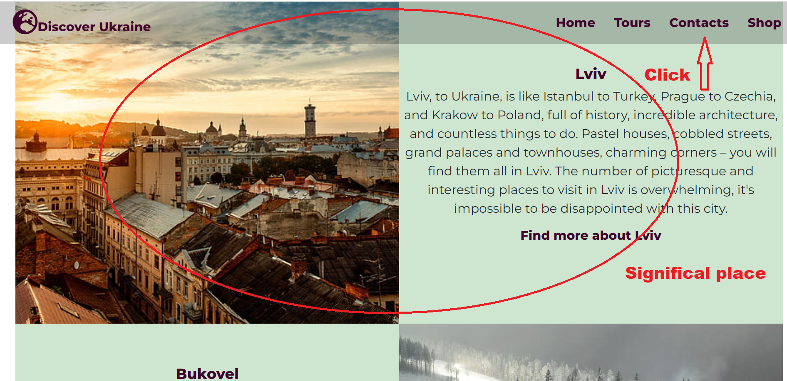

14.   As the site owner, I want users to be able to contact us.

| **Feature** | **Action** | **Expected Result** | **Actual Result** |
|-------------|------------|---------------------|-------------------|
| Contacts section | Click "Contacts" in navbar | See contact form and information about company | Works as expected |

Screenshots

15.   As the site owner, I want to give users an opportunity to choose souvenirs from the store.

| **Feature** | **Action** | **Expected Result** | **Actual Result** |
|-------------|------------|---------------------|-------------------|
| Shop page | Click "Shop" in navbar | See the most common souvenirs on the page | Works as expected |

Screenshots

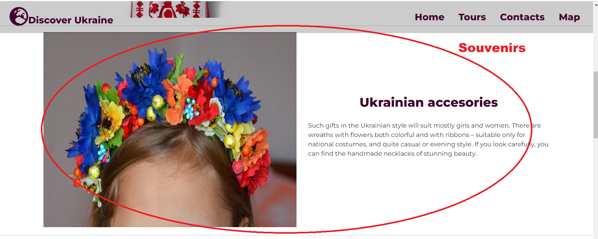

16.   Tell my website viewers information if the requested page is unavailable or, in some cases, doesn't exist.

| **Feature** | **Action** | **Expected Result** | **Actual Result** |
|-------------|------------|---------------------|-------------------|
| Error page | Request unavailable  page | See the 404 error page | Works as expected |

Screenshots

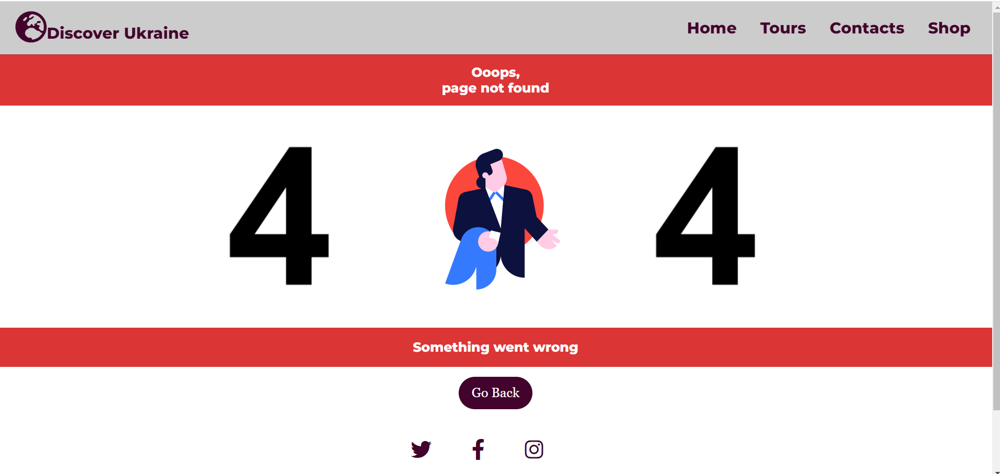

## Bugs
| **Bug**       | **Fix**        |
| --------------| ---------------|
| Navbar divides into two rows on xs screen size |Decrease navbar padding and font size on xs screen|
| Pictures look stretched on medium and small screens|Decrease images height in media query|
| Low performance | Change hero image to webp format  |
| Low accessebility  | Add aria-label attribute to footer links and change h4 to paragraph in main text  |

## Credits

### Code
- The main part of the code was taken from the course [Diploma in Software Development, Code Institute](https://learn.codeinstitute.net/courses/)
- The HTML for the responsive Navbar with toggler was taken from the [Bootstrap v5.2](https://getbootstrap.com/docs/5.2/components/navbar/#how-it-works) documentation code snippet.
- To make flex boxes layout code was taken from [www.w3schools.com](https://www.w3schools.com/css/css3_flexbox.asp) documentation snippet.

### Media
- Photos for hero image and tours section were taken from [wallpaperflare.com](https://www.wallpaperflare.com/)
- Images and text for shop page were taken from website [guideme.com.ua](https://guideme.com.ua/top-10-ukrainian-souvenirs-to-bring-from-kyiv-ukraine/)
- Icons for logo and media links were taken from [Font Awesome](https://fontawesome.com/)
- The creation of the [404 page](https://viacheslav1510.github.io/Portfolio_Project_1-Explore_Ukraine/Pulp%20Fiction) was inspired by Pulp Fiction movie.
## Acknowledgements
- I would like to thank [Code Institute](https://codeinstitute.net/ie/) for great course contents to help me build this website.
- Thanks my mentor Mohammad Shami for his support, suggestions and inspiration.
- I thank my wife for her support and ideas for this website.