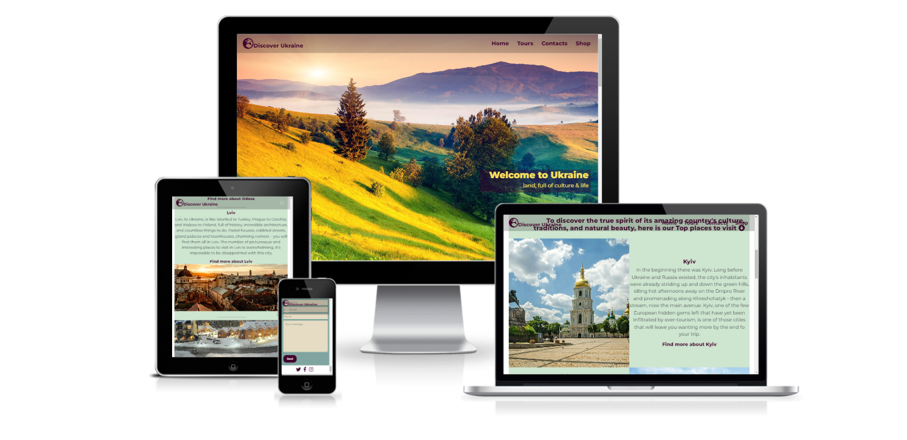

(Developer: Slava Kondriianenko)

Discover Ukraine is a website for tourists who want to go on a trip to Ukraine. The website presents the most visited places of Ukraine, as well as a shop where you can choose some souvenirs from the country.

[Live website](https://viacheslav1510.github.io/Portfolio_Project_1-Explore_Ukraine/)

## Table of Content
- [Table of Content](#table-of-content)
- [Project Goals](#project-goals)
  - [User Goals](#user-goals)
  - [Site Owner Goals](#site-owner-goals)
- [User Experience](#user-experience)
  - [Target Audience](#target-audience)
  - [User Requirements and Expectations](#user-requirements-and-expectations)
  - [User Stories](#user-stories)
    - [First-time User](#first-time-user)
    - [Returning User](#returning-user)
- [Design](#design)
  - [Design Choices](#design-choices)
  - [Colour](#colour)
  - [Fonts](#fonts)
  - [Structure](#structure)
  - [Wireframes](#wireframes)
- [Technologies Used](#technologies-used)
  - [Languages](#languages)
  - [Frameworks \& Tools](#frameworks--tools)
- [Features](#features)
- [Validation](#validation)
  - [HTML Validation](#html-validation)
  - [CSS Validation](#css-validation)
  - [Existing features](#existing-features)
  - [Features left to Implement](#features-left-to-implement)
- [Testing](#testing)
  - [Accessibility](#accessibility)
  - [Performance](#performance)
  - [Device testing](#device-testing)
  - [Browser compatibility](#browser-compatibility)
  - [Testing user stories](#testing-user-stories)
- [Bugs](#bugs)
- [Deployment](#deployment)
- [Credits](#credits)
- [Acknowledgements](#acknowledgements)
    
## Project Goals

### User Goals
- Find directions for travel
- Find what to do in country
- Explore the country's culture
- Be inspired by a new journey
- Buy a souvenir for yourself or for your relatives
### Site Owner Goals
- Find customers for business
- Show customer new country to visit
- Inspire a person on a new journey
- Provide a clear information about tours through Ukraine
- Provide a way to contact the business
- Provide access to the gift shop

## User Experience

### Target Audience
- People deciding where to go on a trip
- People who love travel
- People looking for gifts for themselves and their relatives
### User Requirements and Expectations
- Great content that will make the customer think about the trip
- Intuitive navigation, which will help you navigate the site easily
- Good presentation and consistent design on all screens
- An easy way to contact business
- The shop's product description is available
  
### User Stories

#### First-time User 
- As a first time user, I want to know the best places in the country
- I want to find a place to stay and a good place to eat
- I want to apply for a tour calculation
- I want to find the best souvenirs to remember the trip
- As a first time user, I want easy to contact the company and get a response
  
#### Returning User
- As a a returning user, I want to find new ways to travel
- I want to see the possibility of recreation in the mountains or at the sea, as well as the sights of the cities
- As a returning user, I want to leave some comment, suggestion or message to the staff
- I want to easily find a souvenir shop on the map

## Design

### Design Choices
The web page has been designed keeping in mind the first expression that the customer may have during his first perception. The first look captures the mountain landscape at sunrise with Burnt Maroon color for logo and navigation. Scrolling down the page, the user gets to the significant places section on a soft green (light shade of green) background, which makes customer to stay longer on the website and calmly enjoy the view of the place due to calm shades of the page. 
A minimalist style was chosen for the shop page in order to keep the customer's eye on the products rather than overall view, where photos of souvenirs with a Burnt Maroon title are placed on a white background.
### Colour
For the colour sheme maroon tones were chosen to match the most important information on the page and also the media elements in the footer. The main section with significant places highlighted with a soft green color. Contacts were highlighted with calmly shade of cyan. To narrow down the colours I used Adobe Color. 
 

### Fonts
Montserrat was used for the main page and shop page. Bold font indicates headings, while normal text is used for paragraphs. 
### Structure
The page is structured in a well know, recognizable, user friendly, and easy to learn way. Upon arriving to the website the user sees a familiar type of navigation bar with the business logo on the left side and the navigation links to the right.
Website consists of two separate pages:
- Home page with four sections:
  - Main heading section with background image and navigation bar .
  - Tours section with four significant places.
  - Contacts section with information about business and contact form.
  - Section with links for social media.
- Shop page:
  - Navigation bar on the top of the page.
  - Section with souvenirs examples and their description.
  - Google map section to find the shop on the map
### Wireframes

Home

Shop

## Technologies Used

### Languages
- HTML
- CSS
### Frameworks & Tools
- [Bootstrap v5.2 navbar documentation](https://getbootstrap.com/docs/5.2/components/navbar/#how-it-works)
- Git
- GitHub
- Gitpod
- Visual Studio
- Color Hunt
- Adobe Color
- Balsamiq
- Google Fonts
- Font Awesome
- Favicon

## Features

## Validation

### HTML Validation
### CSS Validation
### Existing features
### Features left to Implement
- landing page
- navigation bar
- tours section
- contact section
- shop page
- footer

## Testing
### Accessibility
### Performance
### Device testing
### Browser compatibility
### Testing user stories

## Bugs
## Deployment
## Credits
## Acknowledgements