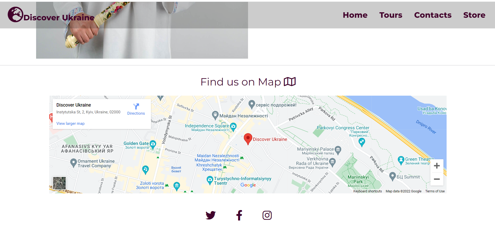

(Developer: Slava Kondriianenko)

Discover Ukraine is a website for tourists who want to go on a trip to Ukraine. The website presents the most visited places of Ukraine, as well as a shop where you can choose some souvenirs from the country.

[Live website](https://viacheslav1510.github.io/Portfolio_Project_1-Explore_Ukraine/)

## Table of Content
- [Table of Content](#table-of-content)
- [Project Goals](#project-goals)
  - [User Goals](#user-goals)
  - [Site Owner Goals](#site-owner-goals)
- [User Experience](#user-experience)
  - [Target Audience](#target-audience)
  - [User Requirements and Expectations](#user-requirements-and-expectations)
  - [User Stories](#user-stories)
    - [First-time User](#first-time-user)
    - [Returning User](#returning-user)
    - [Site Owner](#site-owner)
- [Design](#design)
  - [Design Choices](#design-choices)
  - [Colour](#colour)
  - [Font](#font)
  - [Structure](#structure)
  - [Wireframes](#wireframes)
- [Technologies Used](#technologies-used)
  - [Languages](#languages)
  - [Frameworks \& Tools](#frameworks--tools)
- [Features](#features)
  - [Header](#header)
  - [Tours section](#tours-section)
  - [Contacts section and footer section](#contacts-section-and-footer-section)
  - [Shop page main section](#shop-page-main-section)
  - [Shop page google map section](#shop-page-google-map-section)
- [Validation](#validation)
  - [HTML Validation](#html-validation)
  - [CSS Validation](#css-validation)
  - [Lighthouse testing](#lighthouse-testing)
    - [Desktop](#desktop)
    - [Mobile](#mobile)
  - [Browser compatibility](#browser-compatibility)
- [Bugs](#bugs)
- [Credits](#credits)
  - [Code](#code)
  - [Media](#media)
- [Acknowledgements](#acknowledgements)
    
## Project Goals

### User Goals
- Find directions for travel
- Find what to do in country
- Explore the country's culture
- Be inspired by a new journey
- Buy a souvenir for yourself or for your relatives
### Site Owner Goals
- Find customers for business
- Show customer new country to visit
- Inspire a person on a new journey
- Provide a clear information about tours through Ukraine
- Provide a way to contact the business
- Provide access to the gift shop

## User Experience

### Target Audience
- People deciding where to go on a trip
- People who love travel
- People looking for gifts for themselves and their relatives
### User Requirements and Expectations
- Great content that will make the customer think about the trip
- Intuitive navigation, which will help you navigate the site easily
- Good presentation and consistent design on all screens
- An easy way to contact business
- The shop's product description is available
  
### User Stories

#### First-time User 
1. As a first time user, I want to know the best places in the country
2. I want to find a place to stay and a good place to eat
3. I want to apply for a tour calculation
4. I want to find the best souvenirs to remember the trip
5. As a first time user, I want easy to contact the company and get a response
  
#### Returning User
6. As a a returning user, I want to find new ways to travel
7. I want to see the possibility of recreation in the mountains or at the sea, as well as the sights of the cities
8. As a returning user, I want to leave some comment, suggestion or message to the staff
9. As a returning user, I want to find the company on social media
10. I want to easily find a souvenir shop on the map
#### Site Owner
11. As the site owner, I want users to easy find what this website about
12. As the site owner, I want users to to get to know the most common places in Ukraine.
13. As the site owner, I want users to be able to contact us.
14. As the site owner, I want to give users an opportunity to choose souvenirs from the store.

## Design

### Design Choices
The web page has been designed keeping in mind the first expression that the customer may have during his first perception. The first look captures the mountain landscape at sunrise with Burnt Maroon color for logo and navigation. Scrolling down the page, the user gets to the significant places section on a soft green (light shade of green) background, which makes customer to stay longer on the website and calmly enjoy the view of the place due to calm shades of the page. 
A minimalist style was chosen for the shop page in order to keep the customer's eye on the products rather than overall view, where photos of souvenirs with a Burnt Maroon title are placed on a white background.
### Colour
For the colour sheme maroon tones were chosen to match the most important information on the page and also the media elements in the footer. The main section with significant places highlighted with a soft green color. Contacts were highlighted with calmly shade of cyan. To narrow down the colours I used Adobe Color. 
 

### Font
Montserrat was used for the main page and shop page. Bold font indicates headings, while normal text is used for paragraphs. 
### Structure
The page is structured in a well know, recognizable, user friendly, and easy to learn way. Upon arriving to the website the user sees a familiar type of navigation bar with the business logo on the left side and the navigation links to the right.
Website consists of two separate pages:
- Home page with four sections:
  - Main heading section with background image and navigation bar .
  - Tours section with four significant places.
  - Contacts section with information about business and contact form.
  - Section with links for social media.
- Shop page:
  - Navigation bar on the top of the page.
  - Section with souvenirs examples and their description.
  - Google map section to find the shop on the map
### Wireframes

Home

Shop

Error page

## Technologies Used

### Languages
- HTML
- CSS
### Frameworks & Tools
- [Bootstrap v5.2 navbar documentation](https://getbootstrap.com/docs/5.2/components/navbar/#how-it-works)
- Git
- GitHub
- Gitpod
- Visual Studio
- Color Hunt
- Adobe Color
- Balsamiq
- Google Fonts
- Font Awesome
- Favicon

## Features
### Header
The header contains background image, navbar with logo and main text. Navbar is
sticky on scrolling and let the user navigate through sections and pages. The header is responsive on all screens.

### Tours section
The tours section shows several significant places with links, which contains helps to find more detailed information.
  

### Contacts section and footer section
Contacts section show information about company and gives an opportunity to contact the company representative with a question or proposal.
Footer contains icon links to social media.
  

### Shop page main section
Shop main section contains ideas for souvenirs from Ukraine and their description.

### Shop page google map section
The last section shows google map, which helps user to find offline shop.
  

## Validation

### HTML Validation
Tested HTML code with [W3C Validator](https://validator.w3.org/) and returned no errors.

### CSS Validation
Tested CSS code with [W3C Jigsaw CSS Validation Service](https://jigsaw.w3.org/css-validator/).
When validating the page as a whole, the validator shows some errors linked to Bootstrap v5.0. When validating just my own custom CSS it passes with no errors found and some warnings associated to using root variables.
- Whole page
  
- Custom CSS
  

### Lighthouse testing
#### Desktop
Tested website for desktop on Google Devtools Lighthouse and received high marks.

#### Mobile
Tested website for mobile on Google Devtools Lighthouse.

### Browser compatibility
The website was tested on the following browsers:
- Google Chrome
- Mozilla Firefox
- Microsoft Egde
- Safari

## Bugs
| **Bug**       | **Fix**        |
| --------------| ---------------|
| Navbar divides into two rows on xs screen size |Decrease navbar padding and font size on xs screen|
| Pictures look stretched on medium and small screens|Decrease images height in media query|
| Low performance | Change hero image to webp format  |
| Low accessebility  | Add aria-label attribute to footer links and change h4 to paragraph in main text  |

## Credits

### Code
- The main part of the code was taken from the course [Diploma in Software Development, Code Institute](https://learn.codeinstitute.net/courses/)
- The HTML for the responsive Navbar with toggler was taken from the [Bootstrap v5.2](https://getbootstrap.com/docs/5.2/components/navbar/#how-it-works) documentation code snippet.
- To make flex boxes layout code was taken from [www.w3schools.com](https://www.w3schools.com/css/css3_flexbox.asp) documentation snippet.

### Media
- Photos for hero image and tours section were taken from [wallpaperflare.com](https://www.wallpaperflare.com/)
- Images and text for shop page were taken from website [guideme.com.ua](https://guideme.com.ua/top-10-ukrainian-souvenirs-to-bring-from-kyiv-ukraine/)
- Icons for logo and media links were taken from [Font Awesome](https://fontawesome.com/)
- The creation of the [404 page](https://viacheslav1510.github.io/Portfolio_Project_1-Explore_Ukraine/Pulp%20Fiction) was inspired by Pulp Fiction movie.
## Acknowledgements
- I would like to thank [Code Institute](https://codeinstitute.net/ie/) for great course contents to help me build this website.
- Thanks my mentor Mohammad Shami for his support, suggestions and inspiration.
- I thank my wife for her support and ideas for this website.